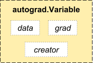
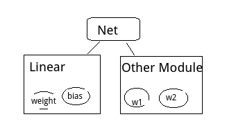

# Pytorch源码：Python层
<div align=center></div>

> 尝试使用了pytorch，相比其他深度学习框架，pytorch显得简洁易懂。花时间读了部分源码，主要结合简单例子带着问题阅读，不涉及源码中C拓展库的实现。

> 注意：这里说的是pytorch0.40之前的版本，因为0.40版本以后更新了一些操作，但是万变不离其宗，看完本文依然可以理解最新的pytorch版本源码。

## 一个简单例子
实现单层softmax二分类，输入特征维度为4，输出为2，经过softmax函数得出输入的类别概率。代码示意：定义网络结构；使用SGD优化；迭代一次，随机初始化三个样例，每个样例四维特征，target分别为1,0,1；前向传播，使用交叉熵计算loss；反向传播，最后由优化算法更新权重，完成一次迭代。
```python
import torch
import torch.nn as nn
import torch.nn.functional as F

class Net(nn.Module):

    def __init__(self):
        super(Net, self).__init__()
        self.linear = nn.Linear(4, 2)

    def forward(self, input):
        out = F.softmax(self.linear(input))
        return out

net = Net()
sgd = torch.optim.SGD(net.parameters(), lr=0.001)
for epoch in range(1):
    features = torch.autograd.Variable(torch.randn(3, 4), requires_grad=True)
    target = torch.autograd.Variable(torch.LongTensor([1, 0, 1]))
    sgd.zero_grad()

    out = net(features)
    loss = F.cross_entropy(out, target)
    loss.backward()
    sgd.step()
```

从上面的例子，带着下面的问题阅读源码：

* pytorch的主要概念：Tensor、autograd、Variable、Function、Parameter、Module（Layers）、Optimizer；
* 自定义Module如何组织网络结构和网络参数；
* 前向传播、反向传播实现流程
* 优化算法类如何实现，如何和自定义Module联系并更新参数。

#### pytorch的主要概念
pytorch的主要概念官网有很人性化的教程Deep Learning with PyTorch: A 60 Minute Blitz， 这里简单概括这些概念：

**Tensor**

类似numpy的ndarrays，强化了可进行GPU计算的特性，由C拓展模块实现。如上面的torch.randn(3, 4) 返回一个3*4的Tensor。和numpy一样，也有一系列的Operation，如

```python
x = torch.rand(5, 3)
y = torch.rand(5, 3)
print x + y
print torch.add(x, y)
print x.add_(y)
```

**Varaiable与autograd**

Variable封装了Tensor，包括了几乎所有的Tensor可以使用的Operation方法，主要使用在自动求导(autograd)，Variable类继承_C._VariableBase，由C拓展类定义实现。
Variable是autograd的计算单元，Variable通过Function组织成函数表达式（计算图）：

<div align=center></div>


* data 为其封装的tensor值
* grad 为其求导后的值
* creator 为创建该Variable的Function，实现中grad_fn属性则指向该Function。
如：
    ```python
    import torch
    from torch.autograd import Variable
    x = Variable(torch.ones(2, 2), requires_grad=True)
    y = x + 2
    print y.grad_fn
    print "before backward: ", x.grad
    y.backward()
    print "after backward: ", x.grad
    ```
    输出结果：  
    ```python
    <torch.autograd.function.AddConstantBackward object at 0x7faa6f3bdd68>
    before backward:  None
    after backward:  Variable containing:
    1
    [torch.FloatTensor of size 1x1]
    ```
调用y的backward方法，则会对创建y的Function计算图中所有requires_grad=True的Variable求导（这里的x）。例子中显然dy/dx = 1。
> 注意：这里说的是pytorch0.40之前的版本，因为0.40以后就Tensor集成了所有Variable的操作，可以直接对Tensor求导，只需设置requires_grad=True属性，详细内容请参考pytorch 1.0官方文档，但是依然是兼容Variable的用法（以后可能会抛弃）。


**Parameter**

Parameter 为Variable的一个子类，后面还会涉及，大概两点区别：

* 作为Module参数会被自动加入到该Module的参数列表中；
* 不能被volatile， 默认require gradient。

**Module**

Module为所有神经网络模块的父类，如开始的例子，Net继承该类，init中指定网络结构中的模块，并重写forward方法实现前向传播得到指定输入的输出值，以此进行后面loss的计算和反向传播。

**Optimizer**

Optimizer是所有优化算法的父类（SGD、Adam、…），init中传入网络的parameters, 子类实现父类step方法，完成对parameters的更新。

## 自定义Module

该部分说明自定义的Module是如何组织定义在构造函数中的子Module,以及自定义的parameters的保存形式，eg:


```python
class Net(nn.Module):
    def __init__(self):
        super(Net, self).__init__()
        self.linear = nn.Linear(4, 2)

    def forward(self, input):
        out = F.softmax(self.linear(input))
        return out
```
首先看构造函数，Module的构造函数初始化了Module的基本属性，这里关注_parameters和_modules，两个属性初始化为OrderedDict()，pytorch重写的有序字典类型。_parameters保存网络的所有参数，_modules保存当前Module的子Module。
module.py：
```python
class Module(object):

   def __init__(self):
        self._parameters = OrderedDict()
        self._modules = OrderedDict()
        ...
```
下面来看自定义Net类中self.linear = nn.Linear(4, 2)语句和_modules、_parameters如何产生联系，或者self.linear及其参数如何被添加到_modules、_parameters字典中。答案在Module的`setattr`方法，该Python内建方法会在类的属性被赋值时调用。
module.py:

```python
def __setattr__(self, name, value):
     def remove_from(*dicts):
         for d in dicts:
             if name in d:
                 del d[name]

     params = self.__dict__.get('_parameters')
     if isinstance(value, Parameter): # ----------- <1>
         if params is None:
             raise AttributeError(
                 "cannot assign parameters before Module.__init__() call")
         remove_from(self.__dict__, self._buffers, self._modules)
         self.register_parameter(name, value)
     elif params is not None and name in params:
         if value is not None:
             raise TypeError("cannot assign '{}' as parameter '{}' "
                             "(torch.nn.Parameter or None expected)"
                             .format(torch.typename(value), name))
         self.register_parameter(name, value)
     else:
         modules = self.__dict__.get('_modules')
         if isinstance(value, Module):# ----------- <2>
             if modules is None:
                 raise AttributeError(
                     "cannot assign module before Module.__init__() call")
             remove_from(self.__dict__, self._parameters, self._buffers)
             modules[name] = value
         elif modules is not None and name in modules:
             if value is not None:
                 raise TypeError("cannot assign '{}' as child module '{}' "
                                 "(torch.nn.Module or None expected)"
                                 .format(torch.typename(value), name))
             modules[name] = value
         ......
```

调用self.linear = nn.Linear(4, 2)时，父类`setattr`被调用，参数name为“linear”， value为nn.Linear(4, 2)，内建的Linear类同样是Module的子类。所以<2>中的判断为真，接着modules[name] = value，该linear被加入_modules字典。
同样自定义Net类的参数即为其子模块Linear的参数，下面看Linear的实现：
linear.py:

```python
class Linear(Module):

    def __init__(self, in_features, out_features, bias=True):
        super(Linear, self).__init__()
        self.in_features = in_features
        self.out_features = out_features
        self.weight = Parameter(torch.Tensor(out_features, in_features))
        if bias:
            self.bias = Parameter(torch.Tensor(out_features))
        else:
            self.register_parameter('bias', None)
        self.reset_parameters()

    def reset_parameters(self):
        stdv = 1. / math.sqrt(self.weight.size(1))
        self.weight.data.uniform_(-stdv, stdv)
        if self.bias is not None:
            self.bias.data.uniform_(-stdv, stdv)

    def forward(self, input):
        return F.linear(input, self.weight, self.bias)
```

同样继承Module类，`init`中参数为输入输出维度，是否需要bias参数。在self.weight = Parameter(torch.Tensor(out_features, in_features))的初始化时，同样会调用父类Module的`setattr`， name为“weight”，value为Parameter，此时<1>判断为真，调用self.register_parameter(name, value)，该方法中对参数进行合法性校验后放入self._parameters字典中。

> Linear在reset_parameters方法对权重进行了初始化。


最终可以得出结论自定义的Module以树的形式组织子Module，子Module及其参数以字典的方式保存。

<div align=center></div>


## 前向传播、反向传播

**前向传播**
例子中out = net(features)实现了网络的前向传播，该语句会调用Module类的forward方法，该方法被继承父类的子类实现。net(features)使用对象作为函数调用，会调用Python内建的魔法方法`__call__`方法，Module重写了该方法。
module.py:

```python
def __call__(self, *input, **kwargs):
   for hook in self._forward_pre_hooks.values():
       hook(self, input)
   result = self.forward(*input, **kwargs)
   for hook in self._forward_hooks.values():
       hook_result = hook(self, input, result)
       if hook_result is not None:
           raise RuntimeError(
               "forward hooks should never return any values, but '{}'"
               "didn't return None".format(hook))
   if len(self._backward_hooks) > 0:
       var = result
       while not isinstance(var, Variable):
           var = var[0]
       grad_fn = var.grad_fn
       if grad_fn is not None:
           for hook in self._backward_hooks.values():
               wrapper = functools.partial(hook, self)
               functools.update_wrapper(wrapper, hook)
               grad_fn.register_hook(wrapper)
   return result
```
`__call__`方法中调用result = self.forward(*input, **kwargs)前后会查看有无hook函数需要调用（预处理和后处理）。
例子中Net的forward方法中out = F.softmax(self.linear(input))，同样会调用self.linear的forward方法F.linear(input, self.weight, self.bias)进行矩阵运算（仿射变换）。
functional.py:

```python
def linear(input, weight, bias=None):
    if input.dim() == 2 and bias is not None:
        # fused op is marginally faster
        return torch.addmm(bias, input, weight.t())

    output = input.matmul(weight.t())
    if bias is not None:
        output += bias
    return output
```
最终经过F.softmax，得到前向输出结果。F.softmax和F.linear类似前面说到的Function（Parameters的表达式或计算图）。

**反向传播**

得到前向传播结果后，计算loss = F.cross_entropy(out, target)，接下来反向传播求导数d(loss)/d(weight)和d(loss)/d(bias)：

```python
loss.backward()
```
backward()方法同样底层由C拓展，这里暂不深入，调用该方法后，loss计算图中的所有Variable(这里linear的weight和bias)的grad被求出。

## Optimizer参数更新

在计算出参数的grad后，需要根据优化算法对参数进行更新，不同的优化算法有不同的更新策略。
optimizer.py:

```python
class Optimizer(object):

    def __init__(self, params, defaults):
        if isinstance(params, Variable) or torch.is_tensor(params):
            raise TypeError("params argument given to the optimizer should be "
                            "an iterable of Variables or dicts, but got " +
                            torch.typename(params))

        self.state = defaultdict(dict)
        self.param_groups = list(params)
       ......
       
    def zero_grad(self):
        """Clears the gradients of all optimized :class:`Variable` s."""
        for group in self.param_groups:
            for p in group['params']:
                if p.grad is not None:
                    if p.grad.volatile:
                        p.grad.data.zero_()
                    else:
                        data = p.grad.data
                        p.grad = Variable(data.new().resize_as_(data).zero_())

    def step(self, closure):
        """Performs a single optimization step (parameter update).

        Arguments:
            closure (callable): A closure that reevaluates the model and
                returns the loss. Optional for most optimizers.
        """
        raise NotImplementedError
```
Optimizer在init中将传入的params保存到self.param_groups，另外两个重要的方法zero_grad负责将参数的grad置零方便下次计算，step负责参数的更新，由子类实现。
以列子中的sgd = torch.optim.SGD(net.parameters(), lr=0.001)为例，其中net.parameters()返回Net参数的迭代器，为待优化参数；lr指定学习率。
SGD.py:

```python
class SGD(Optimizer):

    def __init__(self, params, lr=required, momentum=0, dampening=0,
                 weight_decay=0, nesterov=False):
        defaults = dict(lr=lr, momentum=momentum, dampening=dampening,
                        weight_decay=weight_decay, nesterov=nesterov)
        if nesterov and (momentum <= 0 or dampening != 0):
            raise ValueError("Nesterov momentum requires a momentum and zero dampening")
        super(SGD, self).__init__(params, defaults)

    def __setstate__(self, state):
        super(SGD, self).__setstate__(state)
        for group in self.param_groups:
            group.setdefault('nesterov', False)

    def step(self, closure=None):
        """Performs a single optimization step.

        Arguments:
            closure (callable, optional): A closure that reevaluates the model
                and returns the loss.
        """
        loss = None
        if closure is not None:
            loss = closure()

        for group in self.param_groups:
            weight_decay = group['weight_decay']
            momentum = group['momentum']
            dampening = group['dampening']
            nesterov = group['nesterov']

            for p in group['params']:
                if p.grad is None:
                    continue
                d_p = p.grad.data
                if weight_decay != 0:
                    d_p.add_(weight_decay, p.data)
                if momentum != 0:
                    param_state = self.state[p]
                    if 'momentum_buffer' not in param_state:
                        buf = param_state['momentum_buffer'] = d_p.clone()
                    else:
                        buf = param_state['momentum_buffer']
                        buf.mul_(momentum).add_(1 - dampening, d_p)
                    if nesterov:
                        d_p = d_p.add(momentum, buf)
                    else:
                        d_p = buf

                p.data.add_(-group['lr'], d_p)

        return loss
```
SGD的step方法中，判断是否使用权重衰减和动量更新，如果不使用，直接更新权重param := param - lr * d(param)。例子中调用sgd.step()后完成一次epoch。这里由于传递到Optimizer的参数集是可更改（mutable）的，step中对参数的更新同样是Net中参数的更新。

**小结**
到此，根据一个简单例子阅读了pytorch中Python实现的部分源码，没有深入到底层Tensor、autograd等部分的C拓展实现，后面再继续读一读C拓展部分的代码。
